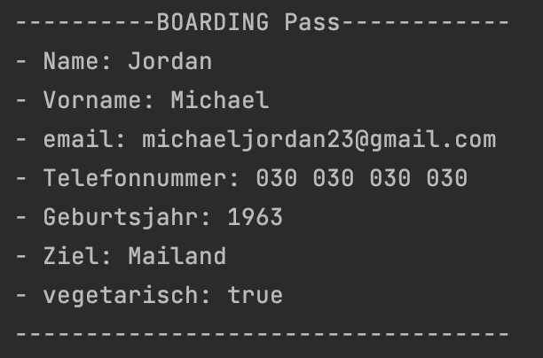
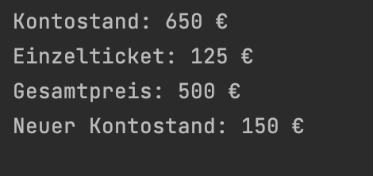
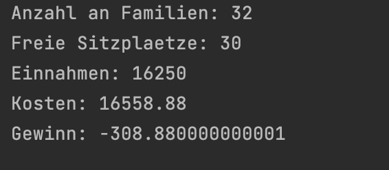

<h1 align="center">Grundlagen der Programmierung</h1>
<h3 align="center">Praxisprojekt Variablen & Datentypen</h3>
 

  

### Beschreibung
Im heutigen Projekt wirst du einige Funktionen für eine hypothetische Fluggesellschaft implementieren. 
Um unbeschwert in den Urlaub fliegen zu können, soll der Boarding Pass "digitalisiert" in der Konsole ausgeben werden. 
Außerdem werden die Ticketpreise, und ob sich der Flug für die Airline lohnt, berechnet. 

> #### Hinweise zur Bearbeitung
> - Achte darauf, dass dein Quellcode sauber ist. Besonders die Einrückungen sind wichtig!
> - Verwende Dokumentationskommentare, um deinen Code zu erklären und zu dokumentieren.
> - Teste deinen Code. Er sollte nicht nur kompilieren und ausführbar sein, sondern auch das gewünschte Ergebnis liefern.
> - `Commit & Push` dein Ergebnis am Ende des Tages
 

 <b> Aufgabe 1 - Vorbereitung  </b> 

 
Erstelle 3 Kotlin (.kt) Dateien im vorgegebene Projekt im Ordner "src". (How to im oberen Video) 
Die Dateien sollen folgende Namen haben: "Passagier", "Bezahlung", "Airline".
Erstelle in jeder der Dateien eine main-Funktion, in der du die jeweiligen Aufgaben bearbeiten wirst.

---

 <b> Aufgabe 2 - Passagierinformation </b> 

**Datei für die Aufgabe:** *Passagier.kt*

Damit die Fluggesellschaft einen komfortablen Flug bieten kann, benötigt sie ein paar Informationen über die Passagiere. 
Bei Verspätungen oder Nicht-Erscheinen, sind beispielsweise Kontaktdaten von Vorteil. 
Um den Kunden auch ein gutes gastronomisches Angebot zu machen, ist es für die Fluggesellschaft außerdem gut zu wissen, ob die Kunden vegetarisch sind.
- Erstelle die 7 folgenden Variablen mit den passenden Datentypen: name, vorname, email, telefonnummer, geburtsjahr, reiseziel, vegetarisch.
- Diese Variablen sollen über Konsoleneingaben befüllt werden.
- Achtet auf sinnvolle Datentypen der einzelnen Variablen!
- Anschließend sollst du einen sogenannten <ins>*Boarding Pass*</ins> auf der Konsole ausgeben.

Dein Ergebnis könnte z.B so aussehen:

---

 <b> Aufgabe 3 - Ticket kaufen </b> 

**Datei für die Aufgabe:** *Bezahlung.kt*

Deine Lieblingsfluggesellschaft bietet einen Hin- und Rückflug für eine 4-köpfige Familie. Ein Ticket kostet 125Euro pro Passagier und dein Kontostand beträgt 650Euro.
- Erstelle die benötigten Variablen, um die Tickets zu kaufen.
- Berechne den Gesamtpreis und den finalen Kontostand. Speichere diese in passenden Variablen und gib sie auf der Konsole aus.
  

Dein Ergebnis könnte z.B so aussehen:

  

---

 <b> Aufgabe 4 - Airline  </b> 

  
**Datei für die Aufgabe:** *Airline.kt*

- Das Flugzeug hat 130 Sitzplätze, wieviele 4-köpfige Familien können mit dem Flugzeug mitgenommen werden? Gib das Ergebnis auf der Konsole aus.
- Wie viele freie Sitzplätze gibt es, wenn 25 4-köpfige Familien die Tickets kaufen? Gib das Ergebnis auf der Konsole aus.
- Der Flug kostet die Fluggesellschaft 16€ pro Kilometer. Die Flugstrecke von Berlin nach Mailand beträgt 1034.93 Kilometer. Wie teuer ist der Flug?
  Gib das Ergebnis auf der Konsole aus.
- Bringt dieser Flug der Fluggesellschaft einen Gewinn, wenn 130 Passagiere mitfliegen?

Dein Ergebnis könnte z.B so aussehen:

**Hinweis**: Überlege dir wann es sinnvoll ist, Variablen und Konstanten anzulegen.

---
